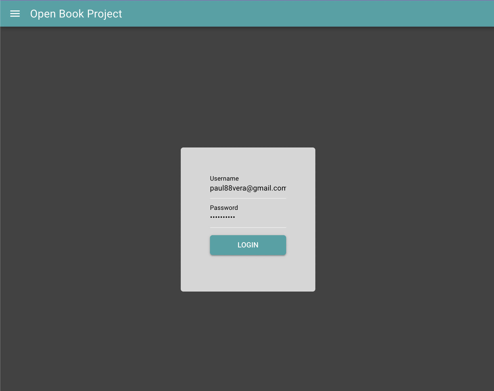

# Quasar-Project



Quasar Project is a login project that shows knowledge in JWT authentication.

## Install the dependencies
```bash
yarn
# or
npm install
```

### Start the app in development mode (hot-code reloading, error reporting, etc.)
```bash
quasar dev
```

## Skills Used
* CSS
* JavaScript
* Axios
* JsonWebToken


## Contact
Email: paul88vera@gmail.com
